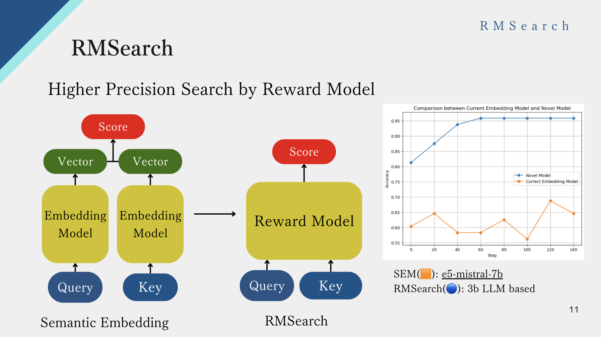
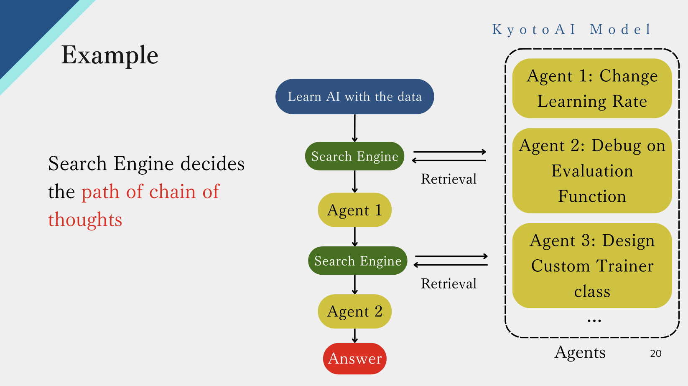
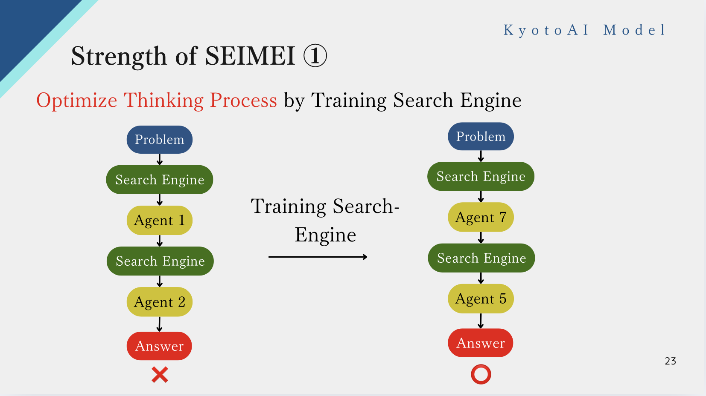
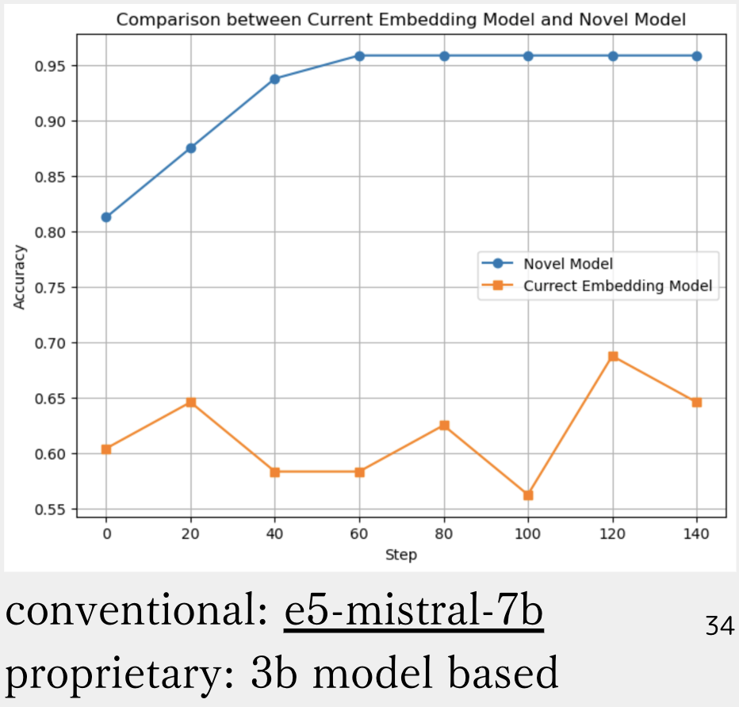
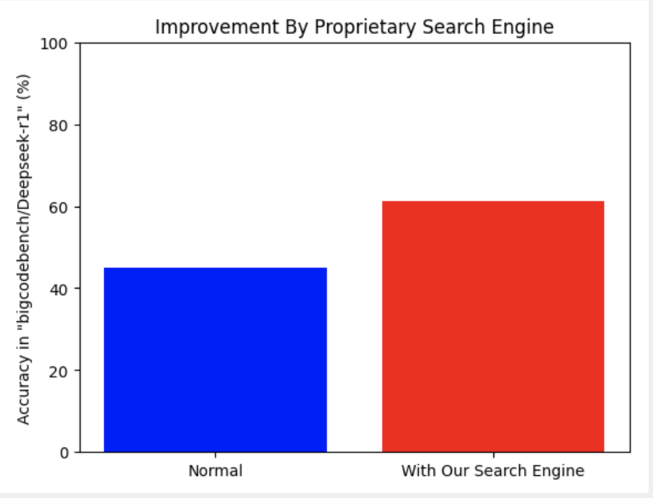
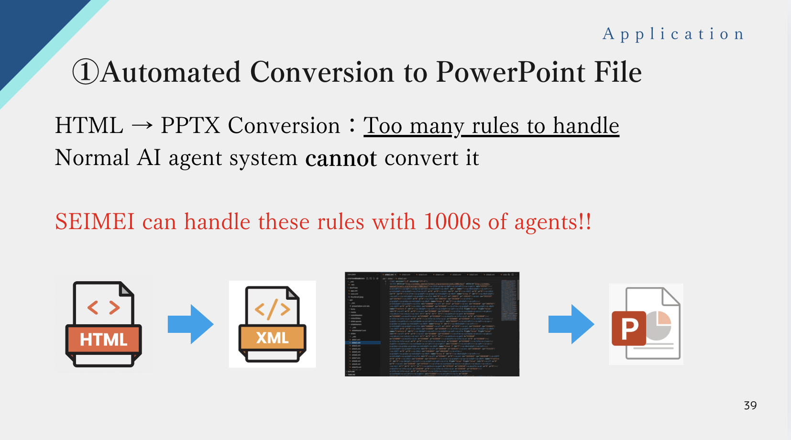
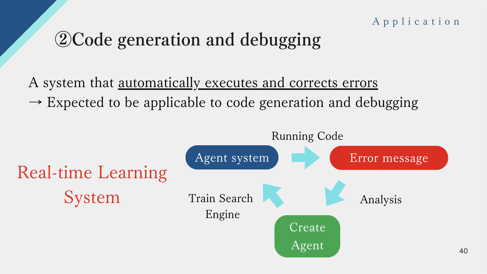
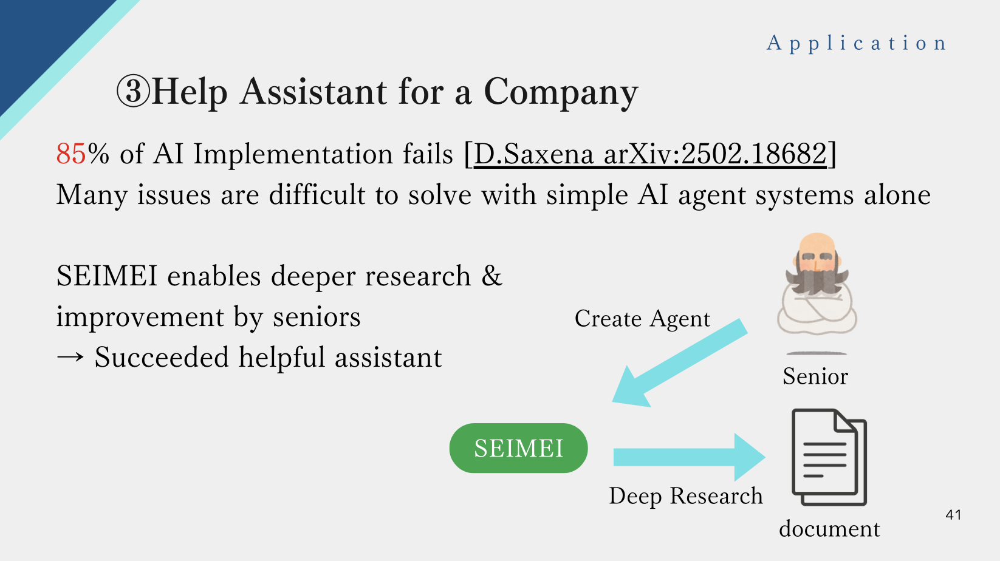

<!-- Improved compatibility of back to top link: See: https://github.com/othneildrew/Best-README-Template/pull/73 -->
<a id="readme-top"></a>
<!--
*** https://github.com/othneildrew/Best-README-Template/blob/main/BLANK_README.md
*** Thanks for checking out the Best-README-Template. If you have a suggestion
*** that would make this better, please fork the repo and create a pull request
*** or simply open an issue with the tag "enhancement".
*** Don't forget to give the project a star!
*** Thanks again! Now go create something AMAZING! :D
-->


<!-- PROJECT SHIELDS -->
<!--
*** I'm using markdown "reference style" links for readability.
*** Reference links are enclosed in brackets [ ] instead of parentheses ( ).
*** See the bottom of this document for the declaration of the reference variables
*** for contributors-url, forks-url, etc. This is an optional, concise syntax you may use.
*** https://www.markdownguide.org/basic-syntax/#reference-style-links
-->
[![Contributors][contributors-shield]][contributors-url]
[![Forks][forks-shield]][forks-url]
[![Stargazers][stars-shield]][stars-url]
[![Issues][issues-shield]][issues-url]
[![MIT License][license-shield]][license-url]
[![LinkedIn][linkedin-shield]][linkedin-url]


<!-- PROJECT LOGO -->
<br />
<div align="center">
  <a href="https://kyotoai.org">
    
  </a>

<h3 align="center">RMSearch</h3>

  <p align="center">
    RMSearch is a high intellectual search tool using reward model instead of semantic embedding model. Agentic search is a good application and RMSearch enables step by step CoT reasoning and optimize the reasoning path!
    <br />
    <a href="https://github.com/kyotoai/RMSearch/tree/main/demo"><strong>Explore the docs »</strong></a>
    <br />
    <br />
    <a href="https://github.com/kyotoai/RMSearch/tree/main/demo">View Demo</a>
    ·
    <a href="https://github.com/kyotoai/RMSearch/issues/new?labels=bug&template=bug-report---.md">Report Bug</a>
    ·
    <a href="https://github.com/kyotoai/RMSearch/issues/new?labels=enhancement&template=feature-request---.md">Request Feature</a>
  </p>
</div>


<!-- TABLE OF CONTENTS -->
<details>
  <summary>Table of Contents</summary>
  <ol>
    <li>
      <a href="#about-the-project">About The Project</a>
      <ul>
        <li><a href="#built-with">Built With</a></li>
      </ul>
    </li>
    <li>
      <a href="#getting-started">Getting Started</a>
      <ul>
        <li><a href="#prerequisites">Prerequisites</a></li>
        <li><a href="#installation">Installation</a></li>
      </ul>
    </li>
    <li><a href="#usage">Usage</a></li>
    <li><a href="#roadmap">Roadmap</a></li>
    <li><a href="#contributing">Contributing</a></li>
    <li><a href="#license">License</a></li>
    <li><a href="#contact">Contact</a></li>
    <li><a href="#acknowledgments">Acknowledgments</a></li>
  </ol>
</details>


<!-- ABOUT THE PROJECT -->
## About The Project

### Search The Best Agent To Make Deep Reasoning
<!-- [![Product Name Screen Shot][product-screenshot]](https://example.com) -->
<br />
<div align="center">
  
</div>

<br />
Here's the example of how SEIMEI works. Each agent interacts with LLM and document and makes inference. These inferences are automatically integrated by search engine and gives an answer of question.

<br />
<div align="center">
  
</div>

<br />
By training search engine, we can optimize the thinking steps like o1 or deepseek-r1!!

<p align="right">(<a href="#readme-top">back to top</a>)</p>

### The Most Intelligent Search Engine
<div align="center">
  
</div>

Our proprietary search model performs better than semantic embedding model(so called vector search). The graph above shows the result of training our model (3b) and e5-mistral-7b model to search best agents. While the vector search model cannot really retrieve best agents(because problems and agents do not have similar sentences), our proprietary search model can learn what agents are needed to solve a question and retrive the best ones!!

<a href="https://github.com/kyotoai/SEIMEI/tree/main/demo"><strong>See more details »</strong></a>

<p align="right">(<a href="#readme-top">back to top</a>)</p>

### Achives State Of The Art Result

<div align="center">
  
</div>

We acheved an improvement of bigcodebench/deepseek-r1 by our search engine!!

<a href="https://github.com/kyotoai/SEIMEI/tree/main/demo"><strong>See more details »</strong></a>

<p align="right">(<a href="#readme-top">back to top</a>)</p>

### Applications of SEIMEI

<div align="center">
  
</div>

<div align="center">
  
</div>

<div align="center">
  
</div>

SEIMEI can be applied to make these useful functions!!

<a href="https://github.com/kyotoai/SEIMEI/tree/main/demo"><strong>See more details »</strong></a>

<p align="right">(<a href="#readme-top">back to top</a>)</p>

### Built With

* [![vLLM][vllm.ai]][vllm-url]
* [![Hugging Face][huggingface.co]][huggingface-url]
  
<!--
* [![Next][Next.js]][Next-url]
* [![React][React.js]][React-url]
* [![Vue][Vue.js]][Vue-url]
* [![Angular][Angular.io]][Angular-url]
* [![Svelte][Svelte.dev]][Svelte-url]
* [![Laravel][Laravel.com]][Laravel-url]
* [![Bootstrap][Bootstrap.com]][Bootstrap-url]
* [![JQuery][JQuery.com]][JQuery-url]
-->

<p align="right">(<a href="#readme-top">back to top</a>)</p>


<!-- GETTING STARTED -->
## Getting Started

This is an example of how you build RMSearch on local gpu or cloud server gpu.
You can use it by downloading this directory into your local folder.

### Prerequisites

This library requires cuda+torch environment with GPU. The memory of GPU should be higher than 12GB to run the sample.

### Installation

* by `pip install`
  
1. Install seimei (not prepared yet)
   ```sh
   pip install rmsearch
   ```


* by downloading SEIMEI repository
  
1. Download the repo
   ```sh
   git clone https://github.com/kyotoai/RMSearch.git
   cd RMSearch
   pip install .
   ```

<p align="right">(<a href="#readme-top">back to top</a>)</p>


<!-- USAGE EXAMPLES -->
## Usage

We are still developing this library. Please wait for it completing soon!

### Quick Start

1. Define search instance
    ```py
    from rmsearch import Search
    search = Search(model_name = "/workspace/llama3b-rm",
            tensor_parallel_size = 1,
            pipeline_parallel_size = 1,)
    ```
    
2. Search the most relevant keys
    ```py
    queries = ["How to make LLM?", "What's the capital of Japan?"] * 5
    keys = ["LLM is Large Language Model which can be made ..."*7, "Japanese capital is ..."*7] * 5
    output = await search(queries, keys)
    print(output)
    ```

<p align="right">(<a href="#readme-top">back to top</a>)</p>


### Train Reward Model For Your Own Tasks (For Developpers)

See the full code in /examples/example_train2.ipynb

1. Generate Tree Structural LLM Output
    ```py
    # This is an example of making agentic tree to optimize brainstorming
    num_depth = 2
    num_branch = 2
    total_num_node = num_branch**(num_depth+1) - 2

    bs_agent_tree = {}  

    # Recursive function to make agentic tree
    def build_bs_agent_tree(**kwargs):

        # make kwargs_ from kwargs

        def _grow(node, depth, **kwargs_):
            if depth == num_depth:
                return

            for b in range(num_branch):
                child = {
                    "agent"   : "something",
                    "node_ids" : node["node_ids"] + [b],
                }
                node["children"].append(child)

                _grow(child, depth + 1, **kwargs_)

        root = {"agent": "root", "node_ids": [], "children": []}
        _grow(root, 0, **kwargs_)
        return root

    # Get output from LLM
    def get_assistant_msg(node, **llm_kwargs):
        output = get_output(node["agent"], **llm_kwargs)
        return output

    # Walk tree to add output
    def populate_tree(node, **llm_kwargs):
        if node["agent"] is not "root":         # skip dummy root
            node["output"], node["ideas"] = get_assistant_msg(
                node,
                **llm_kwargs,
            )

        for child in node["children"]:
            populate_tree(child, **llm_kwargs)

    # Asign agents to each node in bs_agent_tree
    bs_agent_tree = build_bs_agent_tree(
        agents, num_depth=num_depth, num_branch=num_branch,
    )

    # bs_agent_tree = [{"agent":"root", "node_id":[0], "children":[{"agent":"agent1", "node_id":[0, 0], "children":[...]}, ...]

    # Get llm output in each node
    populate_tree(bs_agent_tree, **kwargs)

    # bs_agent_tree = [{"agent":"root", "node_id":[0], "children":[{"agent":"agent1", "output":"...", "node_id":[0, 0], "children":[...]}, ...]
    ```
    
2. Make dataset_list
    ```py
    # dataset_list should be 
    # [{"query":str, "chosen_key":str, "rejected_key":str, **kwargs}, ...]
    # or
    # [{"query":[{"role":"user", "content":"context-and-query-to-get-key"}, ...], "chosen_key":[{"role":"assistant", "content":"chosen-LLM-agent"}, ...], "rejected_key":"chosen_key":[{"role":"assistant", "content":"rejected-LLM-agent"}, **kwargs}, ...]

    def get_dataset_dict(task, chosen_msg, rejected_msg):
        if len(chosen_msg) != len(chosen_msg):
            raise Exception("chosen_msg and rejected_msg must be same size") 

        if len(chosen_msg) == 2:
            return {
                "query":[{'role': 'user', 'content':f"Give me a brainstorming sentence to solve the task below;\n\nTask:{task}"}],
                "chosen_key":[{'role': 'assistant', 'content': chosen_msg[0]["content"]}],
                "rejected_key":[{'role': 'assistant', 'content': rejected_msg[0]["content"]}],
            }
        elif len(chosen_msg) < 2:
            return None
        else:
            return {
                "query": chosen_msg[:-2] + [{'role': 'user', 'content':f"Give me a brainstorming sentence to solve the task below;\n\nTask:{task}"}],
                "chosen_key": [{'role': 'assistant', 'content': chosen_msg[-2]["content"]}],
                "rejected_key": [{'role': 'assistant', 'content': rejected_msg[-2]["content"]}],
            }


    dataset_list = []
    def walk(node, depth):
        global dataset_list

        if node["children"] == []:
            return 0

        else:
            num_novel = 0
            updated_score = 0
            scores = []
            bs_msgs = []
            for i, node_dict in enumerate(node["children"]):
                #dataset_dict = get_dataset_dict(node_dict)
                bs_msg = node_dict["bs_msg"]  # [{"role":}, ...]
                task = node_dict["task"]
                novelties = node_dict["novelties"]
                node_ids = node_dict["node_ids"]

                try:
                    novelty = novelties[0]
                    score = walk(node_dict, depth + 1)
                    if novelty: score += 1
                    updated_score += score
    
                    for j, other_score in enumerate(scores):
                        #print(node_ids, score, other_score)
                        if score < other_score:
                            dataset_dict = get_dataset_dict(task, chosen_msg=bs_msgs[j], rejected_msg=bs_msg)
                        elif score > other_score:
                            dataset_dict = get_dataset_dict(task, chosen_msg=bs_msg, rejected_msg=bs_msgs[j])
                        else:
                            continue
                        
                        dataset_list.append(dataset_dict)
                        
                    bs_msgs.append(bs_msg)
                    scores.append(score)
                except:
                    continue

            updated_score = updated_score / len(node["children"])

        return updated_score

    for bs_agent_tree in bs_agent_trees:
        walk(bs_agent_tree, 0)

    # dataset_list = [{"query":[{"role":"user", "content":"context-and-query-to-get-key"}, ...], "chosen_key":[{"role":"assistant", "content":"chosen-LLM-agent"}, ...], "rejected_key":"chosen_key":[{"role":"assistant", "content":"rejected-LLM-agent"}, **kwargs}, ...]
    ```

3. Train Reward Model
    ```py
    from rmsearch import RMTrainer
    from trl import RewardConfig
    from peft import LoraConfig, TaskType

    model_name = "/workspace/llama3b-rm"
    exp_dir = "/workspace/exp1"
    model_save_dir = f"{exp_dir}/model1"
    test_size = 6
    num_gpus = 1
    batch_size_per_device = 3
    eval_batch_size_per_device = 1

    rmtrainer = RMTrainer(model_name = model_name, num_gpus = num_gpus)
    formatted_dataset = rmtrainer.prepare_dataset(dataset_list, base_dir = exp_dir, test_size = test_size)

    training_args = RewardConfig(
        output_dir=model_save_dir,
        per_device_train_batch_size=batch_size_per_device,
        per_device_eval_batch_size=eval_batch_size_per_device,
        eval_strategy="steps",
        eval_steps=1,
        eval_on_start=True,
        save_steps=10,
        logging_steps=1,
        num_train_epochs = 50,
        report_to=None,
        remove_unused_columns=False,
    )

    peft_config = LoraConfig(
        task_type=TaskType.SEQ_CLS,
        inference_mode=False,
        target_modules=["k_proj","q_proj","o_proj", "v_proj","down_proj","gate_proj","up_proj",],
        layers_to_transform=[25,26,27],
        r=16,
        lora_alpha=16,
        lora_dropout=0.1,
    )

    rmtrainer.train(formatted_dataset, training_args = training_args, peft_config = peft_config)
    ```


<p align="right">(<a href="#readme-top">back to top</a>)</p>


<!-- ROADMAP -->
## Roadmap

### Search
- [ ] Async vLLM
  - [ ] Automatic Compatibility Solver

### Train
- [ ] Reward Trainer
- [ ] Examples of Making MCTS

See the [open issues](https://github.com/github_username/repo_name/issues) for a full list of proposed features (and known issues).

<p align="right">(<a href="#readme-top">back to top</a>)</p>


<!-- CONTRIBUTING -->
## Contributing

Contributions are what make the open source community such an amazing place to learn, inspire, and create. Any contributions you make are **greatly appreciated**.

If you have a suggestion that would make this better, please fork the repo and create a pull request. You can also simply open an issue with the tag "enhancement".
Don't forget to give the project a star! Thanks again!

1. Fork the Project
2. Create your Feature Branch (`git checkout -b feature/AmazingFeature`)
3. Commit your Changes (`git commit -m 'Add some AmazingFeature'`)
4. Push to the Branch (`git push origin feature/AmazingFeature`)
5. Open a Pull Request

<p align="right">(<a href="#readme-top">back to top</a>)</p>

### Top contributors:

<!--<a href="https://github.com/github_username/repo_name/graphs/contributors">-->
<a href="https://github.com/kyotoai/SEIMEI/graphs/contributors">
  
</a>


<!-- LICENSE -->
## License

Distributed under the Apache-2.0 License. See `LICENSE.txt` for more information.

<p align="right">(<a href="#readme-top">back to top</a>)</p>


<!-- CONTACT --><!-- [@twitter_handle](https://twitter.com/twitter_handle) -->
## Contact

* KyotoAI Inc. - office@kyotoai.org

KyotoAI homepage: [https://kyotoai.org](https://kyotoai.org)

Project Link: [https://github.com/kyotoai/RMSearch](https://github.com/kyotoai/RMSearch)

<p align="right">(<a href="#readme-top">back to top</a>)</p>


<!-- ACKNOWLEDGMENTS -->
## Acknowledgments

* [vLLM](https://docs.vllm.ai/en/latest/)
* [Huggingface](https://huggingface.co)
* [Kyoto University Library](https://www.kulib.kyoto-u.ac.jp/mainlib/en/)

<p align="right">(<a href="#readme-top">back to top</a>)</p>


<!-- MARKDOWN LINKS & IMAGES -->
<!-- https://www.markdownguide.org/basic-syntax/#reference-style-links -->
[vllm.ai]: https://img.shields.io/badge/vLLM-blue
[vllm-url]: https://docs.vllm.ai/en/latest/
[huggingface.co]: https://img.shields.io/badge/huggingface-yellow
[huggingface-url]: https://huggingface.co
[contributors-shield]: https://img.shields.io/github/contributors/kyotoai/RMSearch.svg?style=for-the-badge
[contributors-url]: https://github.com/kyotoai/RMSearch/graphs/contributors
[license-shield]: https://img.shields.io/github/license/kyotoai/RMSearch.svg?style=for-the-badge
[license-url]: https://github.com/kyotoai/RMSearch/LICENSE.txt

[forks-shield]: https://img.shields.io/github/forks/kyotoai/RMSearch.svg?style=for-the-badge
[forks-url]: https://github.com/kyotoai/RMSearch/network/members
[stars-shield]: https://img.shields.io/github/stars/kyotoai/RMSearch.svg?style=for-the-badge
[stars-url]: https://github.com/kyotoai/RMSearch/stargazers
[issues-shield]: https://img.shields.io/github/issues/kyotoai/RMSearch.svg?style=for-the-badge
[issues-url]: https://github.com/kyotoai/RMSearch/issues
[linkedin-shield]: https://img.shields.io/badge/-LinkedIn-black.svg?style=for-the-badge&logo=linkedin&colorB=555
[linkedin-url]: https://linkedin.com/in/kentaro-seki-b12000339
[product-screenshot]: images/screenshot.png

[Next.js]: https://img.shields.io/badge/next.js-000000?style=for-the-badge&logo=nextdotjs&logoColor=white
[Next-url]: https://nextjs.org/
[React.js]: https://img.shields.io/badge/React-20232A?style=for-the-badge&logo=react&logoColor=61DAFB
[React-url]: https://reactjs.org/
[Vue.js]: https://img.shields.io/badge/Vue.js-35495E?style=for-the-badge&logo=vuedotjs&logoColor=4FC08D
[Vue-url]: https://vuejs.org/
[Angular.io]: https://img.shields.io/badge/Angular-DD0031?style=for-the-badge&logo=angular&logoColor=white
[Angular-url]: https://angular.io/
[Svelte.dev]: https://img.shields.io/badge/Svelte-4A4A55?style=for-the-badge&logo=svelte&logoColor=FF3E00
[Svelte-url]: https://svelte.dev/
[Laravel.com]: https://img.shields.io/badge/Laravel-FF2D20?style=for-the-badge&logo=laravel&logoColor=white
[Laravel-url]: https://laravel.com
[Bootstrap.com]: https://img.shields.io/badge/Bootstrap-563D7C?style=for-the-badge&logo=bootstrap&logoColor=white
[Bootstrap-url]: https://getbootstrap.com
[JQuery.com]: https://img.shields.io/badge/jQuery-0769AD?style=for-the-badge&logo=jquery&logoColor=white
[JQuery-url]: https://jquery.com 
