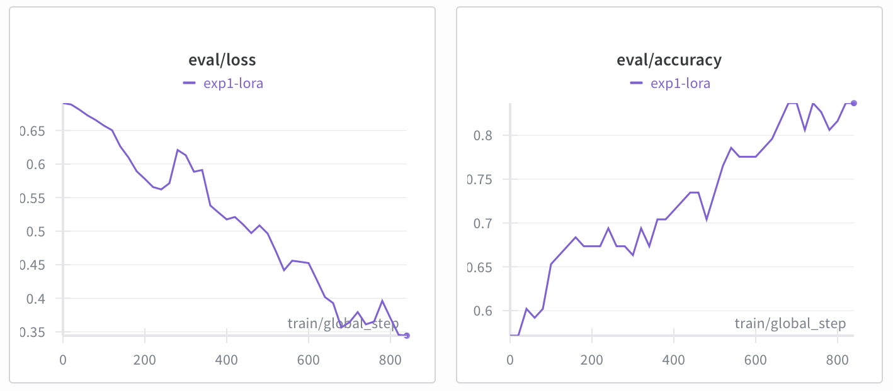
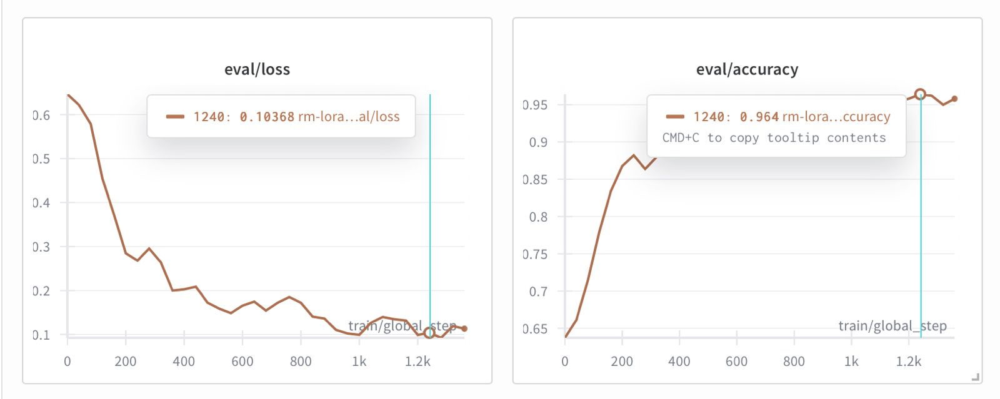

Title: Teaching a Reward Model to Rank: How We Built RMSearch’s Training Pipeline

## Summary (Overview)
We train a reward model that understands which responses are most relevant to a query. The classic direct preference optimization (DPO) setup compares one chosen sentence against one rejected sentence, while our advanced-batched DPO (ADPO) expands the comparisons inside each batch. ADPO evaluates multiple combinations drawn from the same mini-batch, allowing the model to update its weights based on richer feedback. Instead of scattering the same positive example across the dataset, ADPO keeps the chosen key in the batch and contrasts it with several fresh negatives, suppressing over-learning and giving the reward head sharper judgment.

## Make DPO Dataset
We begin with a corpus of sentences, such as a CSV where each row holds a paragraph about enterprise search. From that pool we create synthetic queries like “How does vector search handle multilingual documents?” and pair them with candidate sentences such as “Vector stores can index multilingual embeddings” and “Low latency GPUs accelerate inference.” A baseline DPO dataset contains records shaped as chosen versus rejected pairs: each entry links the query to two sentences, one annotated as more relevant. Think of it as a list of concise decisions, for example: the chosen key answers the query with concrete retrieval steps, while the rejected key drifts into unrelated hardware trivia.

## Make Advanced Batching Dataset
The ADPO dataset keeps the same query inventory but groups sentences differently. For every query we collect one clearly relevant key along with five sampled alternatives that are less fitting. During training the model compares that single positive sentence against several negatives in turn, generating multiple loss contributions from a single batch. The records therefore resemble a compact bundle: query text, a “chosen” key describing the precise retrieval tactic, and five “sampled” keys that are off-target—perhaps focusing on licensing or unrelated metrics. This structure lets the learner explore every pairing without duplicating the positive example across the entire dataset.

## Training
Both datasets feed the same reward-model architecture with LoRA adapters. With standard DPO the loss observes one preference per step, so progress depends on large numbers of unique pairs. ADPO increases the number of effective comparisons per batch because each positive sentence is contrasted with multiple negatives. The optimizer therefore sees richer gradients, balances on-target and off-target cues, and resists memorizing the lone positive phrasing.

## Experiment
In evaluation, the baseline DPO model lifts relevance accuracy but can plateau when the positives repeat too often. The ADPO run, which reuses the positive key within the batch and cycles through five negatives, maintains higher accuracy across held-out queries. The figures above show this gap: the DPO curve climbs steadily before leveling off, while the ADPO curve continues upward thanks to the denser comparisons. This makes ADPO our preferred setting when we need reliable scoring for diverse retrieval workloads.
